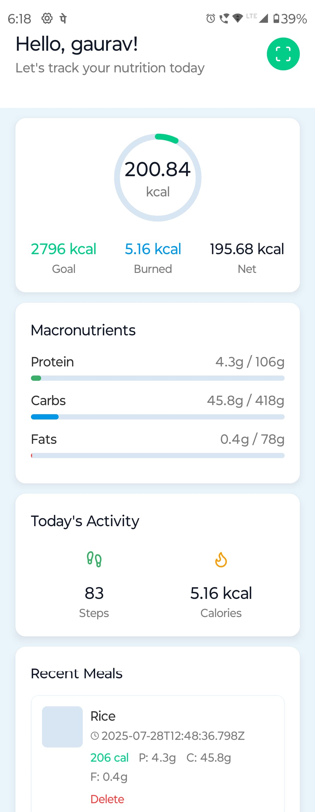
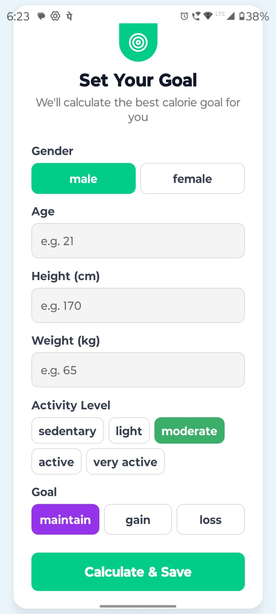
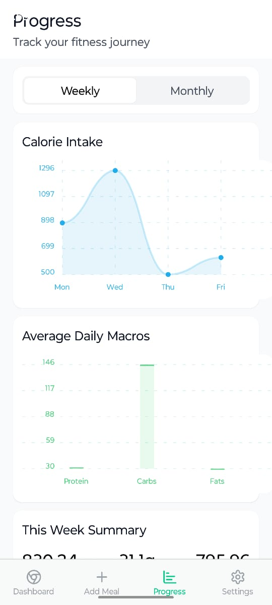
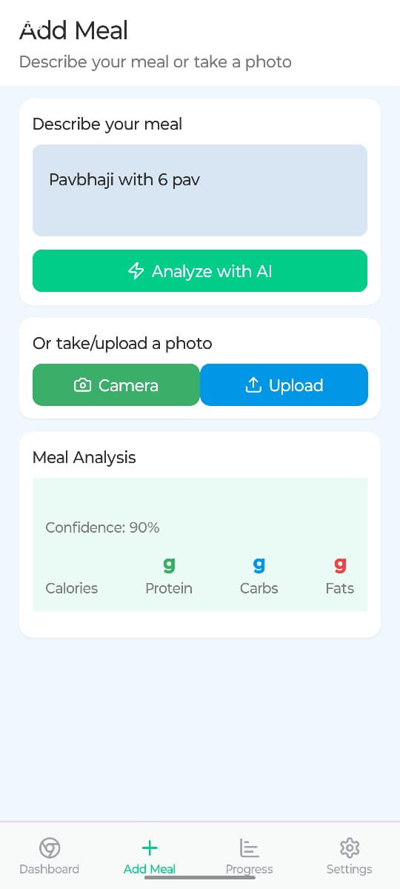

# 🍽️ AI Calorie Tracker App

An intelligent and visually clean Calorie Tracker built with **React Native + Expo Router**, integrated with an **AI-powered backend** that helps users log meals, track calories, and monitor progress toward health goals.

---

## 📱 Features

- 🔐 **Authentication** (Register/Login/Logout)
- 🎯 **Set personalized fitness goals** (maintain/gain/lose)
- 📊 **Dashboard with**:
  - Calorie progress ring
  - Macronutrient breakdown (Protein, Carbs, Fats)
  - Step count + Calories burned
  - Recently logged meals
- 📷 **AI Meal Logging**: Upload or describe food and let AI calculate macros
- 📈 **Progress Screen**:
  - Weekly & Monthly calorie trends
  - Bar chart of average macros
  - Dynamic calorie range analysis
- 📦 **Offline-safe** with AsyncStorage
- 📸 **Meal image uploads**
- 📡 **Barcode Scanner**
- 👣 **Step tracking synced with backend**

---

## 🛠️ Tech Stack

- **Frontend**: React Native + Expo Router + Tailwind CSS (via NativeWind)
- **Backend**: Node.js + Express + MongoDB + Cloudinary
- **AI Integration**: OpenAI / Nutrition API (via backend)
- **Charting**: react-native-chart-kit
- **Device Sensors**: Expo Pedometer, ImagePicker
- **Cloud Build**: EAS (Expo Application Services)

---

## ✨ Getting Started

```bash
# Clone repo
git clone https://github.com/your-username/ai-calorie-tracker.git
cd frontend

# Install dependencies
npm install

# Start expo
npx expo start
```

---

## 📸 Screenshots

### 🏠 Dashboard  


### 🎯 Set Goal  


### 📈 Progress  


### 🍛 Add Meal  


> Make sure to place your screenshots under `assets/screenshots/` or update the paths accordingly.

---

## 📦 Build APK with EAS

```bash
# From frontend folder
eas build -p android --profile preview
```

---

## 🙌 Author

M**Gaurav Chaudhari**

📧 Email: [gauravchaudhari7717@gmail.com]  
🔗 [LinkedIn]([https://linkedin.com/in/yourprofile](https://www.linkedin.com/in/gaurav-chaudhari-b20176227/))

---

## 📄 License

This project is licensed under the **MIT License**.
